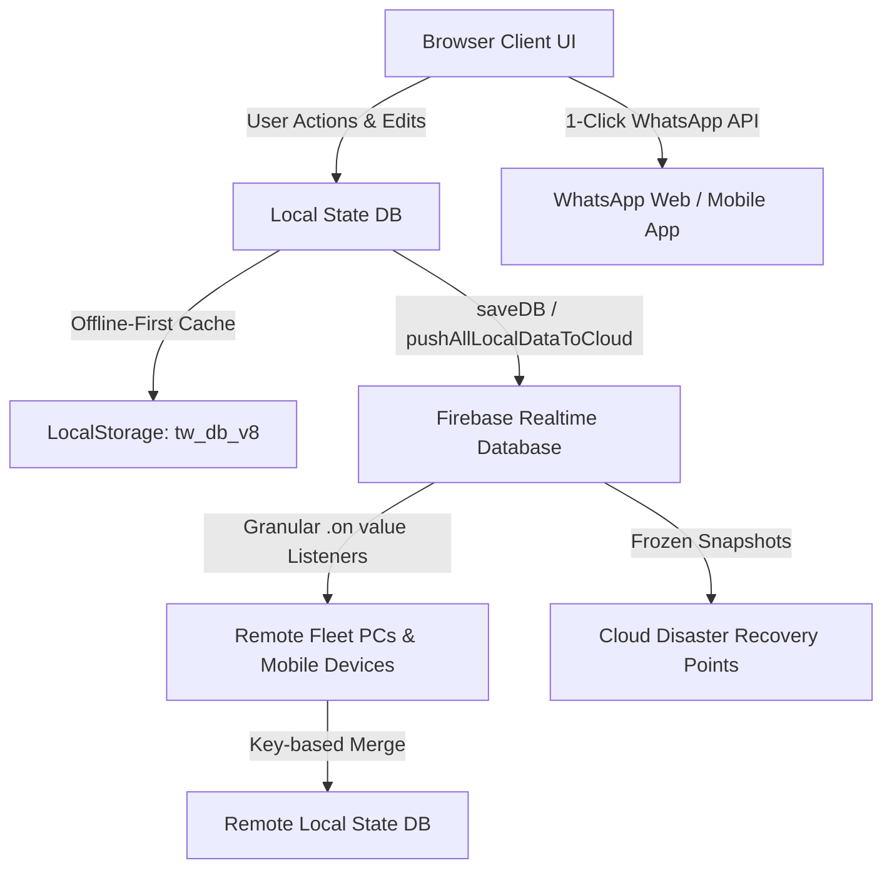

# 🚢 TugWatch Fleet OS — Autonomous AI Agent Guidelines & Architecture Manual

> **Repository:** [FARAZPASTA/TUGWATCH](https://github.com/FARAZPASTA/TUGWATCH)  
> **Production Live URL:** [https://tugwatch.saarvin.in](https://tugwatch.saarvin.in)  
> **Backup Cloud URL:** [https://tugwatch.web.app](https://tugwatch.web.app)  
> **Firebase RTDB:** `https://tugwatch-default-rtdb.firebaseio.com/tugwatch`  
> **Target Fleet:** SAARVIN MARINE FLEET OPERATIONS  

---

## 📌 1. Purpose & Agent Mission

This document defines the architecture, data structures, real-time synchronization protocols, security standards, and coding conventions for all autonomous AI agents (Google Antigravity, OpenAI Codex, Claude, Cursor, Aider, GitHub Copilot) working on the **TugWatch** codebase.

Every agent operating on this repository **MUST** read, understand, and strictly follow the directives in this file before proposing or applying any modifications.

---

## 🏗️ 2. Core Architecture Overview

TugWatch is an enterprise-grade, real-time Maritime Fleet Operations Operating System (OS). It is architected as a high-performance, responsive Single-Page Application (SPA) designed to work seamlessly both on high-speed shore connections and low-bandwidth/offline vessel connections.



### Key Technical Specs:
- **Primary Source File:** `public/index.html` (Unified SPA containing HTML markup, CSS styling, and vanilla JavaScript engine).
- **Cloud Backend:** Google Firebase Realtime Database + Firebase Hosting.
- **State Management:** In-memory reactive `DB` object synchronized bidirectional with Firebase RTDB and cached in `localStorage` under `tw_db_v8`.
- **Offline Resilience:** Reads from LocalStorage on initial boot; connects to Firebase and merges remote deltas seamlessly once network is available.

---

## 🛡️ 3. Critical Rules for AI Agents (Non-Negotiable)

When writing code or modifying TugWatch, all AI agents must enforce the following rules:

### Rule 1: Non-Destructive Real-Time Synchronization
- ❌ **NEVER** perform destructive array replacements (e.g. `DB[collection] = snapshot.val()`) when processing Firebase real-time listeners.
- ✅ **ALWAYS** perform key-based merging using `id` or `username`. This prevents race conditions from overwriting records added simultaneously on another PC (e.g. in Gujarat vs. Maharashtra).
- ✅ **ALWAYS** invoke `saveDB()` after modifying any array in `DB` to ensure changes immediately persist to `localStorage` and push to Firebase.

### Rule 2: Master Administrator Supremacy
- The Master Admin account (`FARAZ` / `ocaptain`) has absolute, irrevocable override permissions.
- Dynamic Admins and Staff Users are stored in `DB.dynamicAdmins`, `DB.accounts`, and `DB.users`.
- Role-based visibility and page locks must strictly check `CU.role` and `CU.perms`.

### Rule 3: 100% Valid JavaScript Syntax
- Before committing or deploying any update to `public/index.html`, run syntax validation using Node.js:
  ```bash
  python3 -c "import re, subprocess; [subprocess.run(['node', '--check', f]) for ...]"
  ```
- No broken string interpolations, missing braces, or undeclared variables in the global namespace.

### Rule 4: Audit Trail Integrity
- Every critical mutation (creating/editing/deleting vessels, crew, certificates, bunker entries, accounts) **MUST** log an entry via `audit(actionDescription, color)`.
- Audits are persisted to `DB.log` and `DB.activityLog` and synced to `tugwatch/activityLog`.

---

## 📦 4. 48-Module Operational Catalog

TugWatch manages 48 granular maritime operational modules grouped across 6 functional divisions:

| # | Division | Modules Included |
|---|---|---|
| **1** | **Fleet & Technical** | Vessels Directory, Vessel Particulars, Deck & Engine Drawings, Mandatory Documents, Deficiencies Tracker, Maintenance Schedule, Dry Dock Planner, Hull & Machinery Surveys |
| **2** | **Navigation & Port Logs** | Voyage Log, Daily Operations Report (DOR), VTMS Stations Directory, Port Clearances, Port Agent Directory, Anchorage Roster, Weather & Lunar Tide Engine |
| **3** | **Engine & Fuel Management** | HSD Fuel Logs, Daily Bunker Consumption, Bunker Sounding Ledger, Engine Running Hours, Lube Oil Inventory, Oil Record Book (ORB Part I) |
| **4** | **Crew & Compliance** | Crew Roster, Sign-On/Sign-Off Register, STCW Certificates & CDC, Crew Wages & Salary Matrix, Medical & KYC Records, Safety Checklists & Drills |
| **5** | **Procurement & Finance** | Material Stock Register, Requisitions & Indents, Purchase Orders (PO), Quotation Comparison Matrix, Vendor Ledger, Invoicing & Billing, Expense Tracking |
| **6** | **Governance & Disaster Recovery** | Master Control Panel, Team User Directory, KYC Dossiers, 1-Click WhatsApp Fleet Briefing, 1-Click Cloud Backup & Disaster Recovery, Live LED Marine Ticker |

---

## ⚡ 5. Key Core Functions & Developer API

### Database & State Layer:
- `saveDB()`: Serializes `DB` to LocalStorage and pushes delta collections to Firebase Realtime Database.
- `loadDB()`: Loads initial state from LocalStorage with fallback defaults.
- `sanitizeDB()`: Ensures all 44+ collections exist as arrays to prevent `undefined` iteration errors.
- `uid()`: Generates unique, collision-resistant string IDs.
- `meta(obj)`: Attaches creation metadata (`_by`, `_at`, `_id`) to new records.

### Navigation & Routing:
- `go(pageId)`: Switches active view container (`.page#p-[pageId]`), executes corresponding hook in `PAGE_HOOKS`, updates breadcrumbs, and scrolls to top.
- `updateRoleVisibility()`: Evaluates `CU` permissions and hides/shows restricted sidebar items and action buttons.

### Automated WhatsApp Dispatch Engine:
- `generateWhatsAppFleetBriefingText()`: Compiles active vessel positions, fuel ROB, master on duty, and expiring certs into formatted WhatsApp Markdown.
- `openWhatsAppFleetBriefingModal()`: Renders interactive modal with live preview, contact picker, and direct `https://api.whatsapp.com/send` dispatcher.
- `sendWhatsAppExpiryBroadcast()`: Aggregates expired (🔴), critical ≤7d (🟠), and upcoming ≤30d (🟡) statutory certificates into a compliance alert broadcast.
- `sendSingleCertWhatsAppAlert(certId)`: Generates targeted renewal notice for a specific certificate for instant surveyor/master dispatch.

### Cloud Backup & Disaster Recovery:
- `downloadCompleteDatabaseBackup()`: Exports timestamped `.json` master backup file and pushes a frozen snapshot to Firebase at `tugwatch/backups/snapshot_[timestamp]`.
- `pushCloudBackupSnapshot()`: Pushes a point-in-time recovery point to Firebase cloud.
- `openDisasterRecoveryModal()`: Opens restoration center with backup file schema validation before execution.
- `executeDatabaseRestore(fileName)`: Restores system state from validated backup and propagates to cloud.

---

## 🚀 6. Git & Deployment Workflow

### Repository Structure:
```text
deploy_tugwatch/
├── AGENTS.md               # Autonomous Agent Guidelines (this file)
├── GEMINI.md               # Gemini Workspace Context
├── firebase.json           # Firebase Hosting & RTDB rules configuration
├── database.rules.json     # Firebase Realtime Database security rules
├── public/
│   ├── index.html          # Unified TugWatch Operating System (Core Engine)
│   └── 404.html            # Error fallback page
```

### Standard Deployment Procedure:
1. **Apply Changes**: Edit `public/index.html` cleanly without corrupting existing script blocks.
2. **Validate Syntax**: Ensure zero errors with Node.js parser (`node --check`).
3. **Commit & Push to GitHub**:
   ```bash
   git add .
   git commit -m "Descriptive commit message"
   git push origin master
   ```
4. **Deploy to Firebase Hosting**:
   ```bash
   npx -y firebase-tools@latest deploy --only hosting
   ```
5. **Verify Live Deployment**: Open [https://tugwatch.saarvin.in](https://tugwatch.saarvin.in) and test active functionality.

---

## 🤝 7. Pair Programming & Agent Collaboration Protocol

- Always provide concise, clear explanations of changes.
- Always include clickable links to modified files and symbols.
- Maintain high security standards: never expose private passwords or cloud API secret keys in plain text.
- When creating automated reports, ensure WhatsApp Markdown formatting uses standard emojis (`🚢`, `⚓`, `🛢️`, `🚨`, `📋`, `✅`, `🔴`, `🟠`, `🟡`) and bold text (`*text*`).

---
*Maintained by the TugWatch Core Engineering Team & Google Antigravity.*
